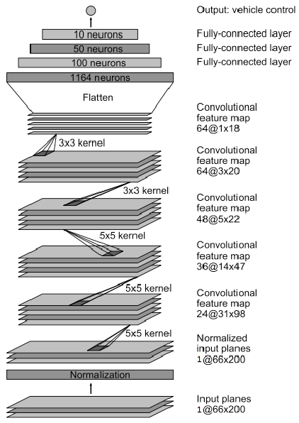

# Introduction

For a car to drive itself, it must have a way to steer its way and stay on
track. Using a simulator and [Keras](https://keras.io), we trained a
convolutional network described in the NVIDIA paper: "[End to End Learning for
Self-Driving
Cars](http://images.nvidia.com/content/tegra/automotive/images/2016/solutions/pdf/end-to-end-dl-using-px.pdf)"
to predict steering angles from images captured by cameras on the simulated car.

The resulting video below shows the simulated car steering its way on the
training track:

[](https://streamable.com/mawj0)


# Running the model

Launch the Udacity simulator, then:

```
$ source activate carnd-term1
$ python drive.py model.h5
````


# Model Architecture

The model chosen is described in the NVIDIA paper: "[End to End Learning for
Self-Driving
Cars](http://images.nvidia.com/content/tegra/automotive/images/2016/solutions/pdf/end-to-end-dl-using-px.pdf)".

It exactly applies to our use-case:

> We trained a convolutional neural network (CNN) to map raw pixels from a
> single front-facing camera directly to steering commands. […] The system
> automatically learns internal representations of the necessary processing
> steps such as detecting useful road features with only the human steering
> angle as the training signal.



The only difference we introduced with regards to the NVIDIA architecture is
that we use an input layer of depth 1 instead of 3: we graycale the images.

An Adam optimizer is used with a learning rate of `10^-4`, empirically determined.


# Training Strategy

We used a generator to load data as needed when training to avoid memory
exhaustion.

Each image is first vertically cropped to avoid the model to adapt to unnecessary
details like the sky, trees on far away hills or the car itself.


Since the samples are 320px wide and that the NVIDIA model accepts 200px wide
samples, we crop horizontally and randomly the samples:


To a random horizontal cropped images is associated an empirically determined
correction factor proportional to the horizontal shift.  It helps adding
diversity in the data set and thus avoiding bias, going from this distribution
of angles:


to this distribution:


Each images are gray-scaled to divide the quantity of data to process by 3
without any noticeable loss in performance:


Each image is then scaled to match the expected dimensions of `66x200` by the
NVIDIA model:


To avoid an angle bias, we flip all images so that the sum of all angles amount
to 0:


This last step augments the data set by a factor of 2.

In order to augment the data set, we used the side cameras of the simulated car:


We empirically determined an angle correction factor of ±0.15 for the left and
right samples.  It helps the car adapt better to curves and augments the data set
by a factor of 3.

Because the car still exhibited misbehaviors, we recorded recovery procedures to
teach it how to go back to the center of the track.  We positioned the car close
to borders, steered away from them and recorded the maneuver.

Parameters that we needed to empirically determined can be found in the `parameters.py`
file:

```
correction = 0.15
params = {
    'correction': correction,
    'crop_y_top': 62, # px
    'crop_y_bottom': 50, # px
    'angle_interval': correction + 0.05,
    'trans_interval': 2*60, # px
    'angle_per_px': -0.008,
    'data_generation_factor': 6,
    'resize_output': (66, 200),
    'learning_rate': 0.0001,
    'nb_epoch': 9,
    'batch_size': 32,
    'data': [
        './data/udacity',
        './data/left_turn_without_border_1',
        './data/left_turn_without_border_2',
        './data/left_turn_without_border_3',
        './data/left_turn_without_border_4',
        './data/sharp_turn_right_1',
        './data/recovery_bridge_1',
        './data/recovery_left_turn_without_border_1',
        './data/recovery_left_turn_without_border_2'
    ],
    'model_path': 'model.h5'
}
```


# Discussion

The output of the model could be smoothed. It would probably make the car go
faster in the simulation and certainly avoid passengers a good headache.

The model does not generalize to the second track: adding dropout layers was
ineffective. More data would probably solve the problem: with 52k images in the
training set and 10k images in the validation set, we could probably add more of
both. The hope is to make the network to isolate road features more accurately. A
way to test this may be to compare intermediary representations across data
addition/augmentations.

Renting GPUs from AWS turned out to be surprisingly expensive: investing in a
GPU would probably turn out to be more interesting over a couple of month of
experimentations.


# Conclusion

Most of the work was done exploring, manipulating and augmenting the data set,
leaving out the model. This choice was motivated by the fact that the NVIDIA
model worked on its data set.  In a sense, we experimented to find the data set
upon which the NVIDIA team trained its model, or one that was close enough for
the model to give acceptable results.

We did not use any sophisticated tool to shape the data set: basic knowledge of
statistics, intuition and lots of trials and errors. Given a model, maybe are
there ways to characterize appropriate data sets? This would probably reduce the
amount of trial and errors to be done.

This model, while encouraging, is of course far from being practically
usable. One important concern being: what happens if a deer crosses the road?
